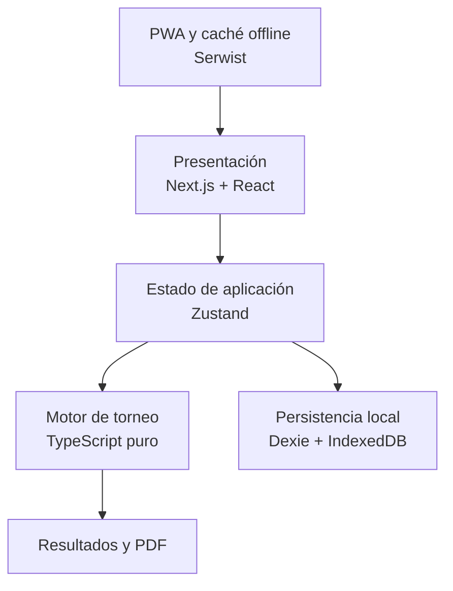
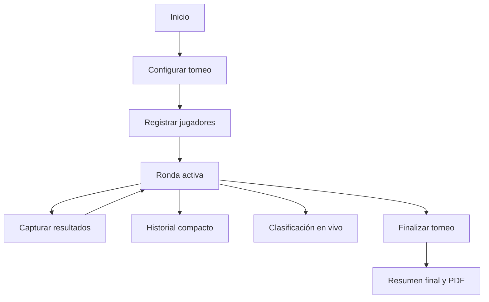

# RETAPADEL

## Plan de producto, arquitectura, stack tecnológico y diseño de la PWA

**Estado:** propuesta consolidada para la versión 1  
**Plataforma:** Progressive Web App (PWA)  
**Enfoque:** mobile first, offline first, sin backend y con un torneo activo por dispositivo

---

## 1. Visión del producto

Retapadel será una PWA orientada a organizar torneos recreativos de pádel con modalidades de rotación de parejas, como 6 loco, 8 loco, 10 loco y variantes equivalentes.

La aplicación permitirá:

- Crear un torneo indicando el número de jugadores y de canchas.
- Registrar los nombres de los participantes.
- Generar rondas con parejas y rivales rotativos.
- Admitir cantidades pares o impares de jugadores.
- Distribuir de forma equilibrada los partidos y descansos.
- Capturar libremente el resultado de cada partido.
- Consultar resultados anteriores durante el torneo.
- Consultar una tabla de estadísticas y clasificación actualizada en vivo.
- Conservar el torneo aunque se cierre la aplicación o el navegador.
- Finalizar el torneo y generar un resumen de resultados.
- Descargar o compartir el resumen final en PDF.
- Eliminar el torneo activo y comenzar uno nuevo.

La primera versión no dependerá de cuentas, servidores, bases de datos remotas ni conexión permanente a internet. El torneo pertenecerá al navegador y dispositivo donde se creó.

---

## 2. Objetivos de la versión 1

### Objetivo principal

Resolver de forma confiable la organización de un torneo informal de pádel desde un teléfono, reduciendo el trabajo manual de crear parejas, decidir descansos, registrar marcadores y calcular resultados.

### Prioridades

1. Motor de rotaciones correcto y comprobable.
2. Persistencia local segura del torneo.
3. Flujo de uso rápido y comprensible.
4. Resultados, estadísticas y clasificación coherentes.
5. Funcionamiento sin conexión.
6. Identidad visual deportiva, sobria y reconocible.
7. Animaciones ligeras que apoyen la interacción.

### Fuera del alcance de la V1

- Registro e inicio de sesión.
- Perfiles permanentes de jugadores.
- Sincronización entre dispositivos.
- Torneos en línea o colaborativos.
- Ranking global.
- Panel administrativo.
- Backend o API propia.
- Base de datos remota.
- Notificaciones push.
- Pagos.

Estas funciones solo deben considerarse si el producto evoluciona a una segunda versión.

---

## 3. Principios del producto

### Mobile first

El escenario principal es una persona organizando el torneo desde su teléfono junto a la cancha. El diseño partirá de un viewport aproximado de `390 × 844 px` y después se adaptará a tablet y escritorio.

### Offline first

Una vez cargada o instalada, la aplicación debe permitir continuar el torneo sin conexión. Los recursos esenciales se almacenarán mediante un Service Worker y los datos del torneo permanecerán en IndexedDB.

### Un torneo activo

Solo podrá existir un torneo activo por navegador. Si hay uno en progreso, la pantalla inicial ofrecerá continuarlo o eliminarlo. Eliminarlo será una acción destructiva con confirmación explícita.

### Lógica independiente de la interfaz

El motor del torneo será TypeScript puro. No dependerá de React, IndexedDB ni APIs del navegador. Esto permitirá probarlo automáticamente y reutilizarlo si posteriormente se crea una aplicación nativa o un backend.

### Claridad antes que decoración

La aplicación tendrá personalidad visual, pero evitará neones, colores fosforescentes, brillos excesivos, partículas y animaciones permanentes. La interfaz debe seguir siendo legible bajo luz exterior y durante el juego.

---

## 4. Arquitectura propuesta



### 4.1 Capa de presentación

Responsable de:

- Pantallas, navegación y componentes.
- Tema claro y oscuro.
- Canchas, marcadores, fichas de jugadores y tablas.
- Formularios y validaciones visuales.
- Animaciones y retroalimentación.
- Accesibilidad y diseño responsivo.

Tecnologías principales: Next.js, React, Tailwind CSS, shadcn/ui, Lucide React y Motion.

### 4.2 Estado de aplicación

Zustand coordinará el estado que necesita la interfaz:

- Torneo activo.
- Ronda seleccionada.
- Partido pendiente de captura.
- Vista activa: ronda, historial o clasificación.
- Tema elegido.
- Mensajes y estados transitorios.

La base de datos local será la fuente persistente de verdad. Zustand no deberá ser el único lugar donde viva el torneo.

### 4.3 Motor de torneo

Contendrá toda la lógica de negocio:

- Validación del número de jugadores y canchas.
- Generación de rondas.
- Selección de jugadores en descanso.
- Formación de parejas.
- Asignación de rivales y canchas.
- Penalización de repeticiones.
- Validación y cierre de partidos.
- Cálculo de clasificación y estadísticas.
- Criterios de desempate.

### 4.4 Persistencia local

IndexedDB, mediante Dexie.js, almacenará de forma estructurada:

- Configuración del torneo.
- Jugadores.
- Rondas.
- Partidos.
- Resultados.
- Historial de parejas y rivales.
- Descansos.
- Estadísticas derivadas o su caché.
- Preferencias de tema.

No se usará `localStorage` como almacenamiento principal del torneo. Puede utilizarse únicamente para preferencias pequeñas si fuera necesario.

### 4.5 PWA y funcionamiento offline

Serwist administrará el Service Worker y el caché de los recursos esenciales:

- Estructura de la aplicación.
- CSS y JavaScript compilados.
- Tipografías e iconos indispensables.
- Recursos visuales propios.
- Página de respaldo offline.

El manifiesto incluirá nombre, iconos, color del tema, orientación y `display: standalone` para que Retapadel se comporte visualmente como una aplicación instalada.

### 4.6 Generación y uso compartido del PDF

El reporte final se construirá en el dispositivo con `pdf-lib` o `jsPDF`. Primero se intentará compartirlo mediante Web Share API; cuando no esté disponible, se ofrecerá descargar el archivo.

---

## 5. Stack tecnológico

| Área | Tecnología propuesta | Función |
|---|---|---|
| Framework | Next.js con App Router | Estructura de la PWA y despliegue |
| Lenguaje | TypeScript | Seguridad de tipos y lógica del torneo |
| UI | React | Componentes e interacción |
| Estilos | Tailwind CSS | Sistema visual y diseño responsivo |
| Componentes base | shadcn/ui | Primitivas accesibles y personalizables |
| Iconografía | Lucide React + SVG propios | Iconos generales y elementos de pádel |
| Animaciones | Motion | Transiciones breves y estados de interacción |
| Estado | Zustand | Coordinación del estado de interfaz |
| Persistencia | IndexedDB + Dexie.js | Torneo local estructurado |
| Validación | Zod | Validación de entradas y datos persistidos |
| PWA | Serwist | Service Worker, precaché y operación offline |
| PDF | pdf-lib o jsPDF | Reporte final descargable/compartible |
| Pruebas unitarias | Vitest | Motor, puntuación y validaciones |
| Pruebas UI | React Testing Library | Flujos y componentes |
| Pruebas E2E | Playwright | Recorrido completo en navegador |
| Hosting | Vercel | Despliegue de la aplicación |
| Backend V1 | Ninguno | No es necesario para el alcance actual |
| BD remota V1 | Ninguna | No es necesaria para el alcance actual |

---

## 6. Modelo conceptual de datos

```ts
type ThemeMode = "system" | "light" | "dark";

interface TournamentConfig {
  id: string;
  name?: string;
  createdAt: string;
  playerCount: number;
  courtCount: number;
  pointsForWin: number;
}

interface Player {
  id: string;
  name: string;
  colorToken: string;
  order: number;
}

interface Round {
  id: string;
  number: number;
  status: "pending" | "active" | "completed";
  matches: Match[];
  restingPlayerIds: string[];
  createdAt: string;
  completedAt?: string;
}

interface Match {
  id: string;
  courtNumber: number;
  teamA: [string, string];
  teamB: [string, string];
  scoreA?: number;
  scoreB?: number;
  winner?: "A" | "B";
  status: "pending" | "completed";
}

interface PlayerStats {
  playerId: string;
  played: number;
  won: number;
  lost: number;
  scoreFor: number;
  scoreAgainst: number;
  difference: number;
  points: number;
  rests: number;
}
```

La clasificación puede recalcularse desde las rondas completadas para evitar inconsistencias. Si se almacena una versión calculada por rendimiento, debe considerarse un caché regenerable y no la fuente principal de verdad.

---

## 7. Reglas y validaciones del torneo

### Reglas de canchas

Cada cancha requiere exactamente cuatro jugadores.

```ts
maximumCourts = Math.floor(numberOfPlayers / 4);
```

| Jugadores | Máximo de canchas utilizables |
|---:|---:|
| 4–7 | 1 |
| 8–11 | 2 |
| 12–15 | 3 |
| 16–19 | 4 |

La interfaz nunca permitirá seleccionar más canchas de las que los jugadores pueden ocupar.

### Cantidad mínima

- No se puede crear un torneo con menos de cuatro jugadores.
- No se puede asignar una cancha sin cuatro jugadores disponibles.
- Los jugadores sobrantes descansan durante la ronda.

### Captura de resultado

El marcador será abierto: no se configurará previamente un número fijo de sets o puntos. El organizador introducirá ambos valores y finalizará el partido.

Validaciones mínimas:

- Ambos valores son enteros y no negativos.
- No se permite empate al cerrar el partido.
- Se identifica al ganador por el marcador mayor.
- Un partido finalizado puede corregirse mediante una acción explícita.
- Una corrección vuelve a calcular automáticamente toda la clasificación.

### Puntuación propuesta

- Victoria: 3 puntos.
- Derrota: 0 puntos.

Orden de desempate propuesto:

1. Puntos.
2. Victorias.
3. Diferencia de marcador.
4. Marcador a favor.
5. Menor cantidad de derrotas.
6. Orden alfabético como último criterio técnico estable.

La puntuación debe quedar encapsulada y ser configurable internamente, ya que el requisito inicial no define cuántos puntos vale una victoria.

---

## 8. Motor de rotaciones

No se implementarán algoritmos aislados para “6 loco”, “8 loco” o “10 loco”. Todas las modalidades serán configuraciones de un motor genérico basado en cantidad de jugadores, canchas e historial.

### Objetivos del algoritmo

El motor intentará, en este orden:

1. Mantener equilibrado el número de partidos jugados.
2. Mantener equilibrado el número de descansos.
3. Evitar descansos consecutivos cuando exista una alternativa válida.
4. Minimizar parejas repetidas.
5. Minimizar rivales repetidos.
6. Evitar repetir exactamente el mismo partido.
7. Mantener variedad entre canchas cuando haya varias.

### Flujo de generación

```text
1. Leer jugadores, canchas e historial.
2. Calcular cuántos jugadores participan en la ronda.
3. Priorizar a quienes han jugado menos o descansado recientemente.
4. Elegir los descansos con criterios de equidad.
5. Generar combinaciones candidatas de parejas y partidos.
6. Calcular una penalización para cada combinación.
7. Elegir la combinación válida con menor penalización.
8. Asignar los partidos a las canchas.
9. Guardar la ronda antes de mostrarla.
10. Actualizar el historial al finalizar sus partidos.
```

### Función de penalización conceptual

```text
penalización =
  parejaRepetida × pesoAlto
  + partidoIdéntico × pesoMuyAlto
  + rivalRepetido × pesoMedio
  + descansoConsecutivo × pesoMuyAlto
  + desequilibrioDePartidos × pesoMuyAlto
  + desequilibrioDeDescansos × pesoAlto
```

Los pesos deberán probarse con simulaciones de muchas rondas. El algoritmo no puede prometer combinaciones irrepetibles indefinidamente: con grupos pequeños, las repeticiones son matemáticamente inevitables. El objetivo real es retrasarlas y repartirlas de la manera más equitativa posible.

### Invariantes que siempre deben cumplirse

- Ningún jugador aparece dos veces en una ronda.
- Cada partido contiene cuatro jugadores diferentes.
- Cada jugador está jugando o descansando, nunca en ambos estados.
- El total de jugadores de la ronda coincide con el total registrado.
- No se utiliza una cancha incompleta.
- Solo se calculan estadísticas a partir de partidos finalizados.

### Pruebas esenciales

El motor deberá probarse al menos con 4 a 20 jugadores, distintas cantidades de canchas y múltiples rondas.

Ejemplo para siete jugadores y una cancha:

```text
✓ 4 jugadores participan
✓ 3 jugadores descansan
✓ nadie se duplica
✓ se minimizan parejas repetidas
✓ se equilibran descansos y partidos jugados
```

Además de pruebas unitarias, conviene ejecutar simulaciones de 50 a 100 rondas por configuración para medir desviaciones y detectar sesgos.

---

## 9. Flujo de navegación



### 9.1 Inicio

Contenido:

- Logotipo Retapadel.
- Mensaje breve de marca.
- Acción principal para crear torneo.
- Tarjeta de torneo en progreso cuando exista.
- Botón para continuar.
- Acción secundaria para eliminar, con confirmación.
- Selector de tema: sistema, claro u oscuro.

### 9.2 Configuración del torneo

Interfaz táctil, no un formulario convencional:

- Control para aumentar o reducir jugadores.
- Representación visual con pelotas o fichas.
- Control para número de canchas.
- Miniaturas de canchas seleccionables.
- Mensajes preventivos cuando una configuración no sea válida.
- Botón Continuar deshabilitado hasta tener una configuración correcta.

### 9.3 Registro de jugadores

- Campo de nombre.
- Botón para agregar.
- Lista numerada de participantes.
- Edición y eliminación antes de iniciar.
- Avatares abstractos basados en iniciales y colores sobrios.
- Validación de nombres vacíos o duplicados.
- Acción para generar la primera ronda.

### 9.4 Torneo: pantalla principal

Será la pantalla más importante de Retapadel.

Encabezado compacto:

- Nombre o identificador del torneo.
- Número de ronda.
- Indicador offline o guardado cuando sea pertinente.
- Acceso a ajustes y finalización.

Navegación interna fija o segmentada:

1. **Ronda:** partidos actuales, canchas y descansos.
2. **Historial:** resultados anteriores sintetizados.
3. **Tabla:** estadísticas y clasificación actualizadas.

El usuario podrá consultar Historial o Tabla sin abandonar ni perder la ronda activa.

### 9.5 Captura de resultado

Cada cancha mostrará:

- Dos parejas claramente separadas por la red.
- Nombres completos o abreviados según el espacio.
- Contadores grandes para ambos equipos.
- Botones táctiles de incremento y reducción.
- Acción Finalizar partido.
- Confirmación breve del ganador.

Cuando todas las canchas de la ronda estén terminadas, se habilitará Generar siguiente ronda.

### 9.6 Historial compacto durante el torneo

El historial se mostrará como una lista agrupada por ronda, sin reproducir canchas completas para no saturar la pantalla.

Ejemplo:

```text
RONDA 3 · COMPLETADA

Cancha 1
Richard / Carlos   4 — 2   Diego / Luis

Cancha 2
Ana / Sofía        3 — 5   Jorge / Mateo
```

Comportamiento:

- La ronda más reciente aparece primero.
- Cada grupo puede expandirse o contraerse.
- El equipo ganador se distingue mediante peso tipográfico e indicador discreto, no mediante brillo.
- Se puede abrir un resultado para corregirlo.
- La corrección actualiza inmediatamente estadísticas y posiciones.
- Se muestra el número de jugadores que descansaron en esa ronda de forma secundaria.

### 9.7 Tabla de estadísticas en vivo

La clasificación estará disponible durante todo el torneo.

Columnas recomendadas para móvil:

| Pos. | Jugador | PJ | PG | DIF | PTS |
|---:|---|---:|---:|---:|---:|

Información ampliada al tocar un jugador:

- Partidos jugados.
- Victorias y derrotas.
- Marcador a favor y en contra.
- Diferencia.
- Puntos.
- Descansos.
- Parejas más frecuentes, si resulta útil.

La tabla debe:

- Actualizarse al finalizar o corregir un partido.
- Mantener visibles jugador y posición al desplazarse horizontalmente.
- Resaltar discretamente los tres primeros lugares.
- Explicar abreviaturas mediante ayuda contextual.
- Indicar que la clasificación es provisional mientras el torneo siga activo.

### 9.8 Finalización y resultados

Antes de finalizar:

- Avisar si existen partidos pendientes.
- Pedir confirmación.
- Congelar el estado final del torneo.

La pantalla final incluirá:

- Podio o primeros lugares.
- Tabla completa.
- Historial de partidos.
- Estadísticas generales.
- Descargar PDF.
- Compartir PDF.
- Eliminar torneo y volver al inicio.

---

## 10. Sistema visual

### Dirección creativa

La identidad será deportiva, premium y minimalista. El pádel se reconocerá mediante la geometría de la cancha, la red, las pelotas y ciertos movimientos, no mediante una acumulación de iconos o colores estridentes.

Características:

- Superficies limpias.
- Contraste cómodo.
- Bordes suaves, no excesivamente redondeados.
- Líneas finas inspiradas en la cancha.
- Tipografía clara y contemporánea.
- Color de cancha como elemento principal del tema.
- Acentos contenidos y sin apariencia neón.

### 10.1 Tema claro: cancha azul

Inspirado en la referencia de superficie azul, pero reducido a un tono más sobrio para interfaz.

| Token | Uso | Color |
|---|---|---|
| `background` | Fondo principal | `#F4F5F2` |
| `surface` | Tarjetas y paneles | `#FFFFFF` |
| `surface-muted` | Zonas secundarias | `#E9ECEA` |
| `text-primary` | Texto principal | `#18201E` |
| `text-secondary` | Texto secundario | `#68716D` |
| `border` | Bordes y divisores | `#D6DCDA` |
| `court` | Superficie de cancha | `#3159A7` |
| `court-dark` | Profundidad/estado presionado | `#284985` |
| `court-line` | Líneas de cancha | `#F5F7FA` |
| `primary` | Acción principal | `#244C8F` |
| `primary-contrast` | Texto sobre acción | `#FFFFFF` |
| `ball` | Pelota y acento deportivo | `#C6C96C` |
| `success` | Resultado correcto | `#47745F` |
| `error` | Error/destructivo | `#B84A4A` |

El azul no debe ocupar todas las superficies: se concentra en la cancha, botones principales, estados seleccionados y detalles de navegación.

### 10.2 Tema oscuro: cancha roja

Inspirado en la referencia de superficie roja, usando un rojo arcilla moderado para evitar una apariencia agresiva o fosforescente.

| Token | Uso | Color |
|---|---|---|
| `background` | Fondo principal | `#121514` |
| `surface` | Tarjetas y paneles | `#1B1F1E` |
| `surface-muted` | Zonas secundarias | `#252A28` |
| `text-primary` | Texto principal | `#F1F3F1` |
| `text-secondary` | Texto secundario | `#A8B0AC` |
| `border` | Bordes y divisores | `#343A37` |
| `court` | Superficie de cancha | `#B74747` |
| `court-dark` | Profundidad/estado presionado | `#8F3737` |
| `court-line` | Líneas de cancha | `#F3EDED` |
| `primary` | Acción principal | `#C05A55` |
| `primary-contrast` | Texto sobre acción | `#FFFFFF` |
| `ball` | Pelota y acento deportivo | `#B9BC68` |
| `success` | Resultado correcto | `#6D9A82` |
| `error` | Error/destructivo | `#D26A64` |

El rojo de cancha no se usará como fondo general ni para todos los botones. Así conserva su fuerza y no confunde acciones normales con acciones destructivas.

### 10.3 Comportamiento del tema

- Valor inicial: seguir la preferencia del sistema operativo.
- Opciones manuales: Sistema, Claro y Oscuro.
- La elección se conserva en el dispositivo.
- El cambio es inmediato y no reinicia el torneo.
- El tema actualiza también `theme-color` de la PWA cuando sea posible.
- Todos los componentes utilizarán tokens semánticos; no tendrán colores escritos directamente en cada componente.
- La cancha cambiará a azul en modo claro y rojo en modo oscuro.
- Los gráficos, PDF y estados deberán mantener contraste accesible.

### 10.4 Distribución aproximada del color

- 75 % fondos y superficies neutras.
- 20 % color deportivo del tema y tonos relacionados.
- 5 % acentos, pelota, estados y alertas.

Esta distribución reemplaza la propuesta inicial basada en verde oscuro y lime. La pelota podrá conservar un amarillo oliva apagado como detalle funcional, nunca como color dominante.

### 10.5 Tipografía

Se recomienda una sans serif contemporánea, legible y gratuita, por ejemplo:

- **Geist Sans** para interfaz y texto.
- **Geist Mono** únicamente para marcadores o cifras si mejora la alineación.

Jerarquía sugerida:

- Display: 32–40 px, peso 700.
- Título de pantalla: 24–28 px, peso 650–700.
- Título de tarjeta: 17–20 px, peso 600.
- Cuerpo: 15–16 px, peso 400–500.
- Etiqueta: 12–14 px, peso 500–600.
- Marcador: 32–48 px, con números tabulares.

---

## 11. Componentes propios de Retapadel

### `PadelBall`

Pelota vectorial minimalista. Usos:

- Indicador de carga.
- Detalle de marca.
- Confirmación de una interacción.
- Transición entre rondas.

Usará el token `ball`, con un amarillo oliva moderado, sin efecto neón.

### `PadelCourt`

Componente distintivo de la aplicación:

- Cambia entre azul y rojo según el tema.
- Representa la red, líneas y cuatro posiciones.
- Se adapta a una o varias canchas.
- Sirve tanto para el partido actual como para seleccionar canchas.
- Mantiene una versión simplificada para pantallas pequeñas.

### `PlayerChip`

Muestra inicial, nombre y estado del jugador: jugando, descansando, ganador o seleccionado.

### `MatchCourtCard`

Integra cancha, parejas, marcador, estado y acción de captura.

### `ScoreCounter`

Control táctil grande con incremento, reducción, validación y números tabulares.

### `RestingPlayers`

Bloque secundario que muestra quién descansa en la ronda y cuántos descansos acumula cada jugador.

### `RoundHistoryItem`

Resumen contraíble de una ronda pasada con canchas, parejas y marcadores.

### `LiveStandingsTable`

Tabla compacta y responsiva con clasificación provisional, cambio de posiciones y detalle por jugador.

### `RankingPosition`

Indicador de posición. Los tres primeros lugares pueden usar tonos metálicos muy apagados, sin convertir la tabla en un podio ornamental.

### `ThemeSelector`

Selector Sistema/Claro/Oscuro, accesible mediante texto e iconos; no dependerá únicamente del símbolo de sol o luna.

### `TournamentSummary`

Resumen reutilizable en la pantalla final y como base visual del PDF.

---

## 12. Animaciones y microinteracciones

Las animaciones serán breves, funcionales y respetarán `prefers-reduced-motion`.

Usos recomendados:

- Rebote sutil de pelota mientras se genera una ronda.
- Entrada y salida lateral al cambiar de ronda.
- Actualización animada del marcador.
- Resaltado breve de la pareja ganadora.
- Reordenamiento suave de posiciones en la tabla.
- Expansión del historial por ronda.
- Confirmación discreta al guardar.
- Transición corta entre temas, evitando animar cada elemento de forma pesada.

Se evitarán:

- Fondos en movimiento continuo.
- Brillos tipo neón.
- Gradientes RGB.
- Partículas flotantes.
- Animaciones largas antes de una acción crítica.
- Movimiento que impida capturar rápidamente un resultado.

---

## 13. Accesibilidad y usabilidad

- Contraste mínimo AA para texto y controles.
- Objetivos táctiles de al menos 44 × 44 px.
- No comunicar ganador, error o estado solo mediante color.
- Etiquetas accesibles para botones con iconos.
- Navegación completa mediante teclado en escritorio.
- Foco visible.
- Soporte para `prefers-reduced-motion`.
- Marcadores y tablas legibles con zoom.
- Confirmación antes de eliminar torneo o sobrescribir un resultado.
- Mensajes en lenguaje directo y no técnico.
- Guardado automático; no depender de que el usuario recuerde guardar.

---

## 14. PDF final

El reporte incluirá:

1. Identidad Retapadel.
2. Fecha y datos generales del torneo.
3. Clasificación final.
4. Estadísticas por jugador.
5. Resultados agrupados por ronda.
6. Estadísticas generales del torneo.

Ejemplos de datos generales:

- Número de jugadores.
- Canchas utilizadas.
- Rondas completadas.
- Partidos jugados.
- Marcador total acumulado.
- Jugador con más victorias.
- Diferencia más alta.

El PDF debe ser legible en pantalla y al imprimirse. No necesita reproducir el tema oscuro: se recomienda una versión clara y neutra con el azul o rojo como acento según el tema seleccionado al generarlo.

---

## 15. Estructura propuesta del proyecto

```text
retapadel/
├─ app/
│  ├─ page.tsx
│  ├─ tournament/
│  │  └─ page.tsx
│  ├─ results/
│  │  └─ page.tsx
│  ├─ layout.tsx
│  ├─ manifest.ts
│  └─ globals.css
├─ components/
│  ├─ ui/
│  ├─ padel/
│  │  ├─ PadelBall.tsx
│  │  ├─ PadelCourt.tsx
│  │  ├─ PlayerChip.tsx
│  │  ├─ MatchCourtCard.tsx
│  │  ├─ ScoreCounter.tsx
│  │  └─ RestingPlayers.tsx
│  ├─ tournament/
│  │  ├─ TournamentHeader.tsx
│  │  ├─ TournamentNavigation.tsx
│  │  ├─ ActiveRound.tsx
│  │  ├─ RoundHistoryItem.tsx
│  │  └─ LiveStandingsTable.tsx
│  └─ theme/
│     └─ ThemeSelector.tsx
├─ core/
│  └─ tournament/
│     ├─ rotation-engine.ts
│     ├─ candidate-generator.ts
│     ├─ penalty-calculator.ts
│     ├─ scoring.ts
│     ├─ statistics.ts
│     ├─ validators.ts
│     └─ types.ts
├─ db/
│  ├─ database.ts
│  ├─ migrations.ts
│  └─ repositories/
│     └─ tournament-repository.ts
├─ stores/
│  ├─ tournament-store.ts
│  └─ preferences-store.ts
├─ lib/
│  ├─ pdf/
│  ├─ share/
│  └─ theme/
├─ public/
│  ├─ icons/
│  └─ assets/
└─ tests/
   ├─ tournament/
   ├─ components/
   └─ e2e/
```

---

## 16. Estrategia de pruebas

### Motor de torneo

- Validaciones de jugadores y canchas.
- Reparto de descansos.
- Equilibrio de partidos jugados.
- Penalización de parejas y rivales repetidos.
- Invariantes de cada ronda.
- Corrección de resultados.
- Criterios de desempate.
- Simulaciones extensas por configuración.

### Persistencia

- Cerrar y reabrir la aplicación.
- Recuperar una ronda incompleta.
- Migrar versiones del esquema local.
- Manejar datos incompletos o corruptos.
- Eliminar el torneo completamente.

### Interfaz

- Crear torneo válido e inválido.
- Agregar, editar y eliminar jugadores.
- Capturar un resultado.
- Consultar historial y regresar a la ronda.
- Consultar clasificación en vivo.
- Corregir un resultado y recalcular la tabla.
- Alternar entre claro y oscuro.
- Generar, descargar y compartir PDF.

### PWA

- Instalar en Android/iOS compatibles.
- Abrir sin conexión después de la primera carga.
- Actualizar a una nueva versión sin perder el torneo.
- Verificar iconos, manifest y modo standalone.

---

## 17. Fases de implementación

### Fase 1 — Dominio y reglas

- Definir tipos y entidades.
- Formalizar puntuación y desempates.
- Construir validadores.
- Implementar motor de rotaciones.
- Crear pruebas y simulaciones.

### Fase 2 — Persistencia local

- Diseñar esquema de IndexedDB.
- Crear repositorio de torneo.
- Implementar guardado automático.
- Recuperar torneo al iniciar.
- Manejar versiones y migraciones.

### Fase 3 — Flujo funcional

- Inicio.
- Configuración.
- Registro de jugadores.
- Ronda activa.
- Captura y corrección de resultados.
- Siguiente ronda y finalización.

### Fase 4 — Historial y estadísticas

- Historial compacto por ronda.
- Clasificación provisional.
- Detalle por jugador.
- Recálculo después de correcciones.

### Fase 5 — Sistema visual

- Tokens de temas.
- Modo claro azul.
- Modo oscuro rojo.
- Componentes propios de pádel.
- Responsive y accesibilidad.

### Fase 6 — PWA y PDF

- Manifest e iconos.
- Service Worker.
- Operación offline.
- PDF.
- Compartir/descargar.

### Fase 7 — Calidad y despliegue

- Pruebas end-to-end.
- Auditoría de accesibilidad.
- Revisión de rendimiento.
- Pruebas en dispositivos reales.
- Despliegue en Vercel.

---

## 18. Criterios de aceptación de la V1

La versión 1 se considerará funcional cuando:

- Permita crear un torneo con cualquier cantidad válida de jugadores y canchas.
- Impida configuraciones sin cuatro jugadores por cancha.
- Genere rondas sin duplicar jugadores.
- Reparta partidos y descansos de manera razonablemente equilibrada.
- Minimice repeticiones de parejas y rivales.
- Permita capturar y corregir resultados.
- Muestre el historial sintetizado durante el torneo.
- Muestre una clasificación provisional actualizada.
- Mantenga el torneo tras cerrar y reabrir la aplicación.
- Funcione offline después de la carga inicial.
- Cambie entre modo claro y oscuro sin perder información.
- Muestre cancha azul en claro y roja en oscuro.
- Permita finalizar, descargar y compartir resultados en PDF.
- Permita eliminar completamente el torneo activo.
- Cumpla contraste, tamaño táctil y reducción de movimiento básicos.

---

## 19. Riesgos y decisiones pendientes

### Riesgos principales

1. **Equidad del algoritmo:** es el riesgo técnico más importante y requiere simulaciones, no solo ejemplos manuales.
2. **Pérdida de datos local:** si el usuario borra los datos del navegador o cambia de dispositivo, el torneo se pierde.
3. **Actualizaciones de la PWA:** deben gestionarse sin reemplazar o corromper un torneo activo.
4. **Restricciones de compartir archivos:** Web Share API no se comporta igual en todos los navegadores; la descarga debe existir como respaldo.
5. **Ambigüedad de “sets”:** los ejemplos usan resultados como 4–2, pero debe definirse si representan sets, juegos, puntos o una unidad libre. La aplicación puede llamarlo inicialmente “marcador” para no imponer una interpretación incorrecta.

### Decisiones que deben cerrarse antes de programar puntuación

- Confirmar si la victoria vale 3 puntos.
- Confirmar criterios de desempate.
- Definir si una ronda necesita todos sus partidos terminados antes de avanzar.
- Definir si puede editarse la lista de jugadores después de iniciar.
- Definir si se permite abandonar temporalmente a un jugador por lesión o salida.
- Definir cuándo termina el torneo: manualmente, por rondas o por tiempo.

Para la V1 se recomienda finalización manual y bloquear cambios de jugadores una vez iniciada la primera ronda. Incorporar altas, bajas y sustituciones durante el torneo aumenta de forma considerable la complejidad del equilibrio.

---

## 20. Conclusión técnica

La arquitectura recomendada para Retapadel V1 es:

```text
Next.js + TypeScript + React
Tailwind CSS + shadcn/ui + Motion
Zustand
Dexie + IndexedDB
Serwist
Vitest + Testing Library + Playwright
pdf-lib o jsPDF
Vercel
```

Sin login, backend, API propia ni base de datos remota.

La prioridad no debe ser comenzar por las pantallas más vistosas. El activo central será el motor de rotaciones, seguido por la persistencia y el flujo completo. El diseño, los temas y las animaciones deben construirse sobre una lógica ya comprobada.

La identidad visual queda definida por superficies neutras, tipografía limpia, componentes inspirados en el pádel y dos canchas temáticas: **azul sobrio en modo claro** y **rojo arcilla en modo oscuro**. El historial compacto y la clasificación provisional estarán disponibles durante todo el torneo sin interrumpir la ronda activa.
